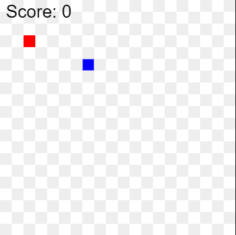
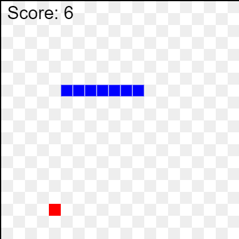
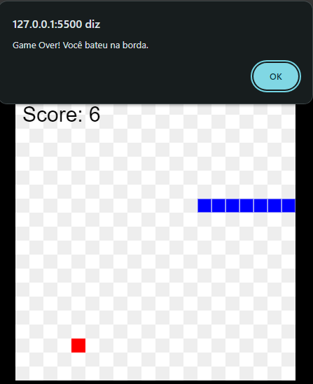

# Jogo da Cobrinha 🐍

Este é um simples jogo da cobrinha, desenvolvido em JavaScript, HTML e CSS. O objetivo do jogo é controlar a cobrinha e coletar o máximo de maçãs possível sem bater nas paredes ou colidir com o próprio corpo.


## 🎮 Como Jogar

- Use as teclas **W**, **A**, **S**, **D** para mover a cobrinha:
  - **W**: Move para cima.
  - **A**: Move para a esquerda.
  - **S**: Move para baixo.
  - **D**: Move para a direita.
- A cada maçã que a cobrinha come, ela cresce em tamanho.
- O jogo termina quando a cobrinha bate na borda do canvas ou colide com seu próprio corpo.
  



## 🛠 Tecnologias Utilizadas

- **HTML**: Estrutura básica do jogo.
- **CSS**: Estilização do canvas e da página.
- **JavaScript**: Lógica do jogo, incluindo movimentação da cobrinha, geração de comida e verificação de colisões.

## 🚀 Como Executar o Projeto

1. Clone este repositório:

   ```bash
   git clone https://github.com/ArquitetaRachel/snakeGame.git

2. Navegue até o diretório do projeto:

    ```bash
    cd jogo-da-cobrinha

3. Abra o arquivo index.html em seu navegador preferido.

## 📂 Estrutura de Arquivos
- index.html: Contém a estrutura HTML básica do jogo.
- style.css: Contém as regras de estilo para o jogo.
- script.js: Contém toda a lógica do jogo em JavaScript.

## 📝 Funcionalidades
- Movimentação da Cobrinha: A cobrinha se move de acordo com as teclas pressionadas.
- Crescimento: Cada vez que a cobrinha come uma maçã, ela cresce.
- Game Over: O jogo acaba quando a cobrinha bate na borda ou colide com seu próprio corpo.
- Pontuação: A pontuação é baseada no número de maçãs comidas.


